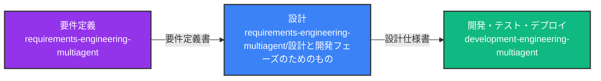
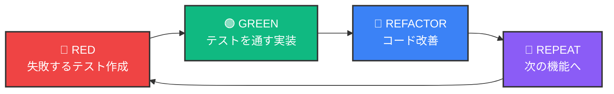
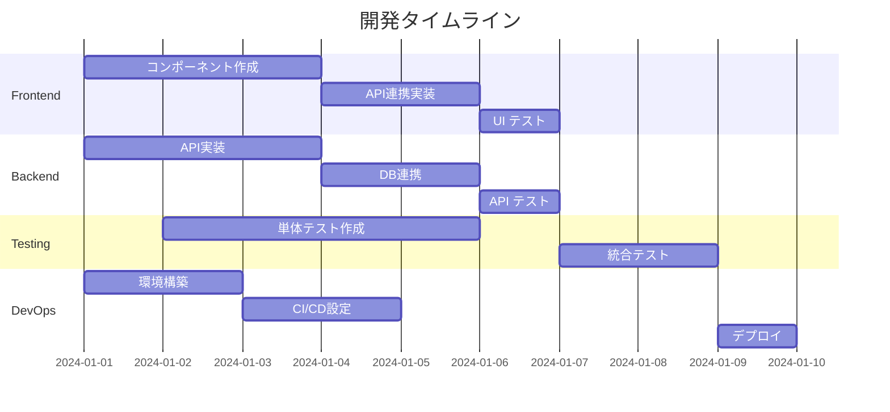
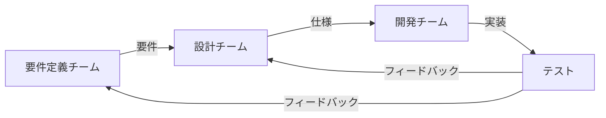

# 🛠️ Development Engineering MultiAgent System

[](https://opensource.org/licenses/MIT)
[](https://claude.ai/code)
[](./docs/tdd-guide.md)

設計仕様書から実装・テスト・デプロイまでを自動化するAI開発チーム - TDD駆動開発対応

## 🌟 概要

Development Engineering MultiAgent System は、要件定義・設計フェーズで作成された仕様書を基に、実際の開発・テスト・デプロイメントを行うマルチエージェントシステムです。

### 🎯 なぜこのシステムが必要か？

#### 開発現場の課題
- **設計と実装の乖離**: 設計書通りに実装されないことが多い
- **品質のばらつき**: 開発者によってコード品質に大きな差
- **テストの不足**: 手動テストに依存し、品質保証が不十分

#### このシステムの価値
- **設計の忠実な実装**: AIが設計書を理解し、正確に実装
- **TDD による品質保証**: テストファーストで高品質なコードを生成
- **マルチAI対応の柔軟性**: 将来的に異なるAI（GPT-4、Gemini等）を各役割に最適配置可能

### 🔄 全体のワークフロー



## 🎭 開発チーム構成

### 通常開発チーム（Dev Team）
1. **👨‍💻 フロントエンド開発者（Frontend Developer）**
   - UI実装（React/Vue/Angular）
   - 状態管理実装
   - API連携
   - レスポンシブ対応

2. **⚙️ バックエンド開発者（Backend Developer）**
   - APIエンドポイント実装
   - ビジネスロジック実装
   - データベース操作
   - 認証・認可実装

3. **🧪 テストエンジニア（Test Engineer）**
   - ユニットテスト作成
   - 統合テスト作成
   - E2Eテスト実装
   - テストカバレッジ管理

4. **🚀 DevOpsエンジニア（DevOps Engineer）**
   - CI/CDパイプライン構築
   - Dockerコンテナ化
   - Kubernetes設定
   - 本番環境デプロイ

### TDD開発チーム（TDD Team）
1. **🎯 テストリード（Test Lead）**
   - TDDプロセス管理
   - テスト先行作成
   - 品質基準設定
   - 「赤→緑→リファクタリング」サイクル管理

2. **⚙️ バックエンド開発者（Backend Developer）**
   - テストを通す最小限の実装
   - APIエンドポイント実装
   - ビジネスロジック実装

3. **🎨 フロントエンド開発者（Frontend Developer）**
   - コンポーネントテストに基づく実装
   - UI/UX実装
   - 統合テスト対応

4. **🔍 レビューエンジニア（Review Engineer）**
   - コードレビュー
   - リファクタリング提案
   - ベストプラクティス適用

5. **🔗 統合エンジニア（Integration Engineer）**
   - 統合テスト実行
   - CI/CDパイプライン管理
   - デプロイメント

## 🚀 クイックスタート

### 前提条件

1. 要件定義完了（requirements-engineering-multiagent）
2. 設計仕様書作成済み（アーキテクチャ、API、DB、UI設計）

### セットアップ手順

#### 通常開発の場合
```bash
# 1. リポジトリをクローン
git clone https://github.com/username/development-engineering-multiagent.git
cd development-engineering-multiagent

# 2. サンプルプロジェクトへ移動
cd examples/sample-api-project

# 3. 設計仕様書をインポート
./import-design-specs.sh \
  --architecture ../../requirements-engineering-multiagent/設計と開発フェーズのためのもの/設計フェーズ/アーキテクチャ設計/ \
  --api ../../requirements-engineering-multiagent/設計と開発フェーズのためのもの/設計フェーズ/API設計/ \
  --database ../../requirements-engineering-multiagent/設計と開発フェーズのためのもの/設計フェーズ/データベース設計/

# 4. 開発チームのセットアップ
./setup-dev-team.sh

# 5. 開発開始
./start-development.sh
```

#### TDD開発の場合
```bash
# 1. TDDプロジェクトセットアップ
cd scripts
./setup-tdd-multiagent.sh

# 2. プロジェクト名と技術スタックを選択
> my-tdd-project
> React + TypeScript
> Node.js + Express
> PostgreSQL

# 3. エージェント用Worktreeセットアップ
cd projects/my-tdd-project
./setup-worktrees.sh

# 4. TDDサイクル開始
./start-tdd-cycle.sh

# 5. 進捗モニタリング（別ターミナル）
python3 ../../scripts/monitor-tdd-progress.py . --watch
```

## 📂 プロジェクト構造

```
development-engineering-multiagent/
├── docs/                               # ドキュメント
│   ├── getting-started.md              # クイックスタートガイド
│   ├── architecture/                   # システムアーキテクチャ
│   ├── best-practices/                 # ベストプラクティス
│   └── tutorials/                      # チュートリアル
├── templates/                          # テンプレート
│   ├── character-configs/              # エージェント設定
│   │   └── dev-team/                   # 開発チーム設定
│   │       ├── frontend-developer.yaml
│   │       ├── backend-developer.yaml
│   │       ├── test-engineer.yaml
│   │       └── devops-engineer.yaml
│   └── code-templates/                 # コード生成テンプレート
│       ├── frontend/
│       ├── backend/
│       ├── tests/
│       └── infrastructure/
├── examples/                           # サンプルプロジェクト
│   ├── sample-api-project/             # APIプロジェクトサンプル
│   └── sample-fullstack-project/       # フルスタックサンプル
├── scripts/                            # ユーティリティスクリプト
│   ├── setup-tdd-multiagent.sh         # TDD開発セットアップ
│   ├── generate-tdd-claude-config.py   # TDDエージェント設定生成
│   ├── monitor-tdd-progress.py         # TDD進捗モニタリング
│   ├── generate-dev-claude-config.py   # 通常開発エージェント設定
│   └── deploy.sh                       # デプロイスクリプト
└── .github/                            # GitHub設定
    └── workflows/                      # CI/CD設定

```

## 🎯 開発フローの詳細

### 通常開発フロー

```bash
# 各エージェントが設計仕様を理解
Frontend Developer: UI設計書とAPI仕様書を読み込み
Backend Developer: API仕様書とDB設計書を読み込み
Test Engineer: 全仕様書から テストケースを抽出
DevOps Engineer: アーキテクチャ設計からインフラ要件を理解
```

### TDD開発フロー



### 2. 並行開発の実行



### 3. エージェント間の連携

各エージェントはGit Worktreeで独立して作業し、以下の方法で連携：

- **共有仕様書**: `shared/specs/` ディレクトリ
- **進捗報告**: `sync/progress/` ディレクトリ
- **APIモック**: Backend → Frontend への提供
- **テストデータ**: Test Engineer → 全員への提供

## 📋 生成される成果物

### フロントエンド
```
output/frontend/
├── src/
│   ├── components/         # UIコンポーネント
│   ├── pages/             # ページコンポーネント
│   ├── services/          # API通信
│   ├── store/             # 状態管理
│   └── utils/             # ユーティリティ
├── tests/                 # フロントエンドテスト
└── package.json
```

### バックエンド
```
output/backend/
├── src/
│   ├── controllers/       # コントローラー
│   ├── services/         # ビジネスロジック
│   ├── models/           # データモデル
│   ├── middleware/       # ミドルウェア
│   └── utils/            # ユーティリティ
├── tests/                # バックエンドテスト
└── package.json
```

### インフラストラクチャ
```
output/infrastructure/
├── docker/
│   ├── Dockerfile.frontend
│   ├── Dockerfile.backend
│   └── docker-compose.yml
├── kubernetes/
│   ├── deployments/
│   ├── services/
│   └── ingress/
└── terraform/
    ├── main.tf
    ├── variables.tf
    └── outputs.tf
```

## 🔧 カスタマイズ

### 技術スタックの変更

`config/tech-stack.yaml` で技術スタックをカスタマイズ：

```yaml
frontend:
  framework: "react"  # react, vue, angular
  language: "typescript"
  state: "redux"      # redux, mobx, zustand

backend:
  language: "node"    # node, python, java, go
  framework: "express" # express, fastapi, spring, gin
  database: "postgresql"

testing:
  unit: "jest"
  e2e: "cypress"
  
infrastructure:
  container: "docker"
  orchestration: "kubernetes"
  cloud: "aws"        # aws, gcp, azure
```

## 🤝 要件定義・設計チームとの連携

### データフロー

1. **要件定義書** → 開発チーム全員が参照
2. **設計仕様書** → 各専門エージェントが必要部分を参照
3. **実装成果物** → テストエンジニアが検証
4. **テスト結果** → 要件との照合

### フィードバックループ



## 📚 詳細ドキュメント

- [開発チーム紹介](./docs/team-introduction.md)
- [TDD開発ガイド](./docs/tdd-guide.md)
- [コード生成ガイド](./docs/code-generation-guide.md)
- [テスト戦略](./docs/testing-strategy.md)
- [デプロイメントガイド](./docs/deployment-guide.md)

## 🔧 高度な機能

### TDD進捗ダッシュボード
```bash
# リアルタイムモニタリング
python3 scripts/monitor-tdd-progress.py projects/my-project --watch

# ダッシュボード例:
# 📊 Current Phase: 🔴 RED (テスト作成中)
# 🧪 Test Statistics
#   - Total Tests: 42
#   - Passing: 12
#   - Failing: 30
#   - Coverage: 45.2%
```

### 統合スクリプト
```bash
# 要件定義→設計→開発の完全パイプライン
../integration-scripts/full-pipeline.sh --project my-project --auto
```

## 🚨 注意事項

- 生成されたコードは必ずレビューが必要です
- セキュリティ脆弱性のチェックを忘れずに
- 本番環境へのデプロイは慎重に

## 📄 ライセンス

このプロジェクトは [MIT License](./LICENSE) のもとで公開されています。

---

*「設計ができたら、あとは実装するだけ。でも、実装が一番大変なんだよね」 - フリーレン*